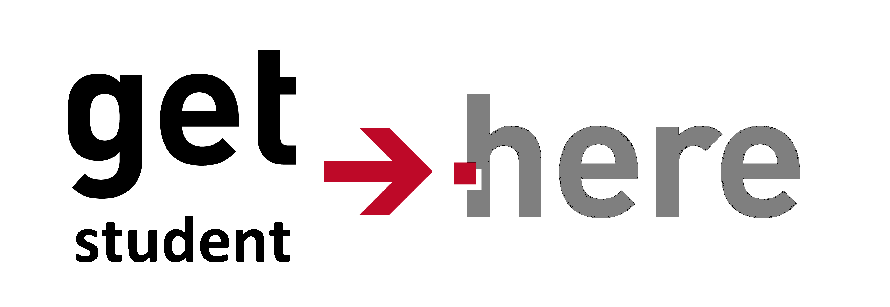
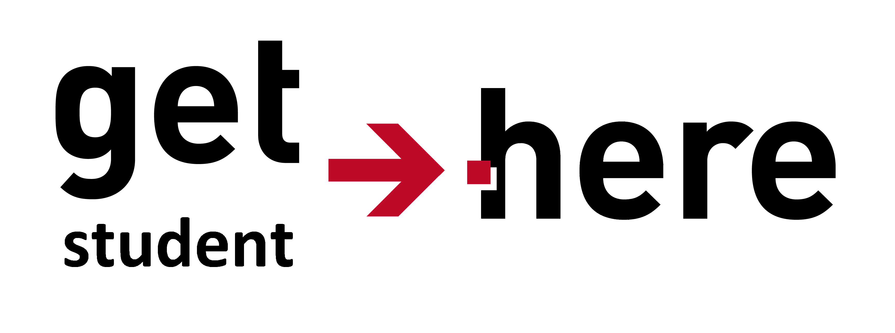

<!-- 
- Inweven van leerprocess. 
- Tekst reductie eerste helft. 
- Intentie presentatie veranderen naar leerproces. 
- Spelling 
--> 

# GT Academy: Student Portal
## To inspire excellent students to join us. 

Note: Academy leertraject, en project. 

---

### Waarom wil Get There studenten aantrekken?

- Nieuwe generaties brengen nieuwe innovaties. 
<!-- .element: class="fragment" -->
- Innovatie is wat een IT bedrijf uniek positioneert op de markt. 
<!-- .element: class="fragment" -->
- Gebrek aan innovatie leidt tot verlies in bestaansrecht.
<!-- .element: class="fragment" -->

<!-- .element: class="fragment" height="150px" width="auto" -->
 
<!-- .element: class="fragment" height="150px" width="auto" -->
 
<!-- .element: class="fragment" height="150px" width="auto" -->

---

### Get There is niet alleen.
- Quintor organiseert hackathons, wedstrijden en werkt nauw samen met
  scholen. 
<!-- .element: class="fragment" -->
- Atos lanceerde eventpoint om young proffesionals aan te trekken.
<!-- .element: class="fragment" -->
- Jaarlijkste omzet van YoungCapital steeg met 28%.
<!-- .element: class="fragment" -->

---

### Hoe kunnen studenten Get There nog vinden?
- Dure externe recruiters?
<!-- .element: class="fragment" -->
- Google?
<!-- .element: class="fragment" -->
- Scholen?
<!-- .element: class="fragment" -->

---

### Hoe kan Get There zich uniek positioneren op deze markt?
Wat zoekt de uitstekende ambitieuze student waar Get There zo opzoek naar is?

---

###  Een plek met een actieve, speelse en inspirerende community.

<!-- .element: height="500px" width="auto" -->

---

###  Een plek waar hij/zij met alle vrijheid zichzelf kan ontplooien en veel kan leren.

<!-- .element: height="450px" width="auto" -->

---

### Een plek waar uitstekende ontwikkelaars werken. 
 
<!-- .element: height="500px" width="auto" -->

---

### GT student portal

---

# [Demo](http://localhost:8080/)
Note: Angular, Jquery, Javascript, Html/css, Spring library tags, JSP. 

---

### Hoe recruiten wij de student?
 

---

### Hoe worden IT'ers gerecruit? 
- Standaard uitnodigingen.
<!-- .element: class="fragment" -->
- Maken keuzes voor jou.
<!-- .element: class="fragment" -->
- Wat zou de student willen?
<!-- .element: class="fragment" -->
Note: 1.Ze kennen je niet, persoonlijke benadering. 2. Ze kijken naar skillset, niet interesses.
---

### GT student portal

---

# [Demo](http://localhost:8080/)
Note: Spring, Hibernate, Security, Forms, Apache commons, 

---

### GT Student portal
- Get students here
<!-- .element: class="fragment" -->
- Keep students here
<!-- .element: class="fragment" -->

Note: Gemaakt door en voor studenten, Verlaagd kosten recruitment. Creeert een sfeer. persoonlijke proactieve benadering. eenvoudig  keuze  maken inspireren.

---

### De toekomst van GT Student Portal 
- Sociale media integratie
<!-- .element: class="fragment" -->
- Notificatie systeem
<!-- .element: class="fragment" -->
- Bekijken afgelopen evenementen
<!-- .element: class="fragment" -->
- Aansluitend design op Get There.
<!-- .element: class="fragment" -->

---

# Vragen? 
